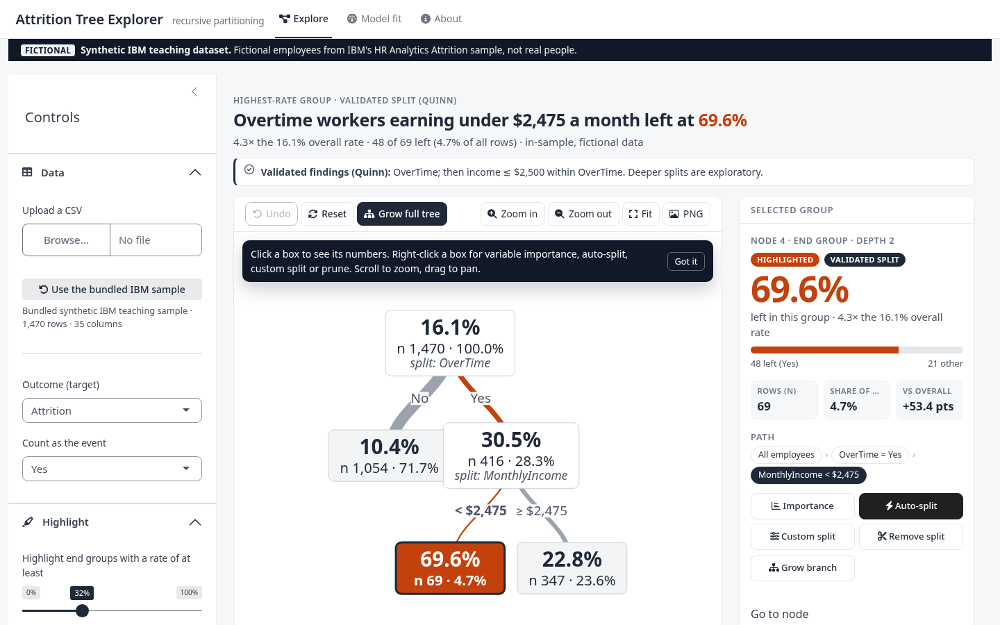
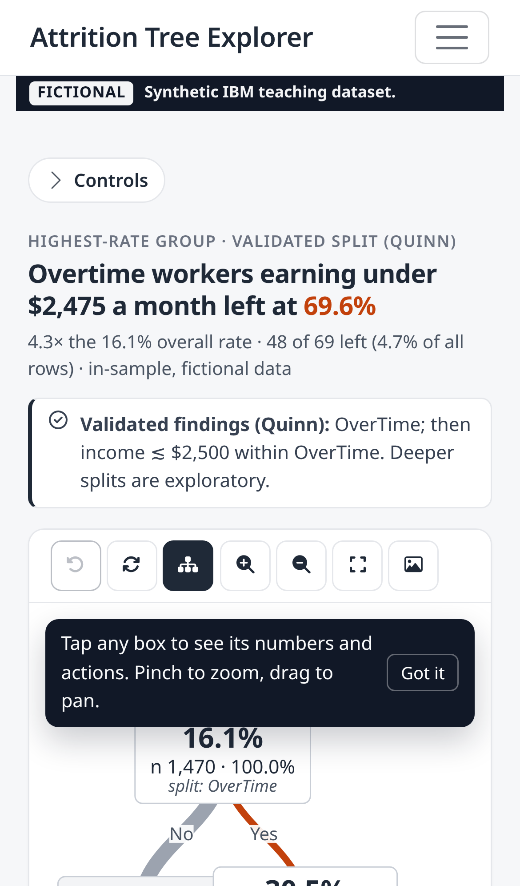
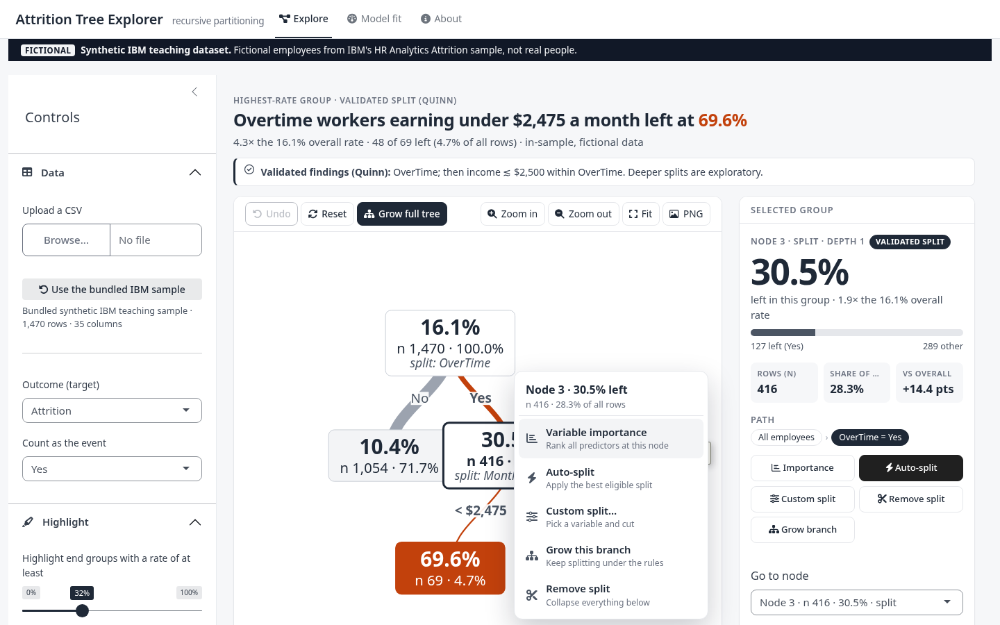
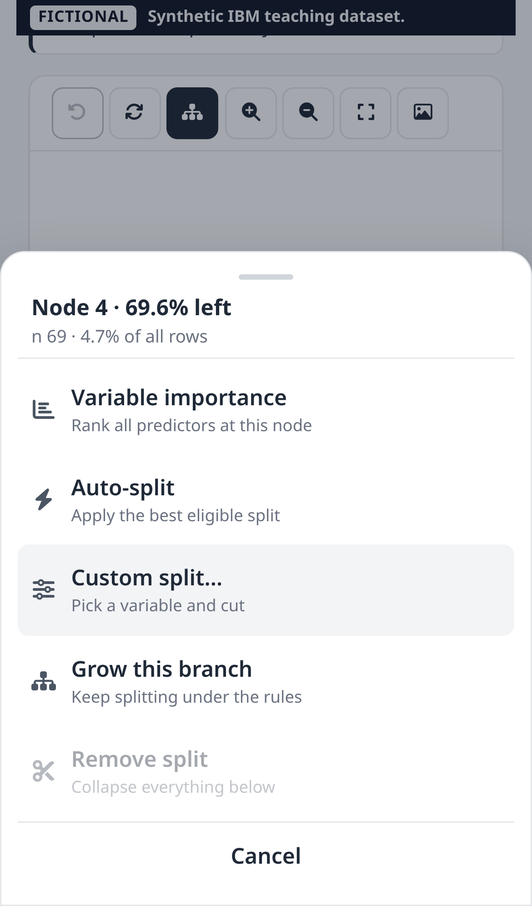
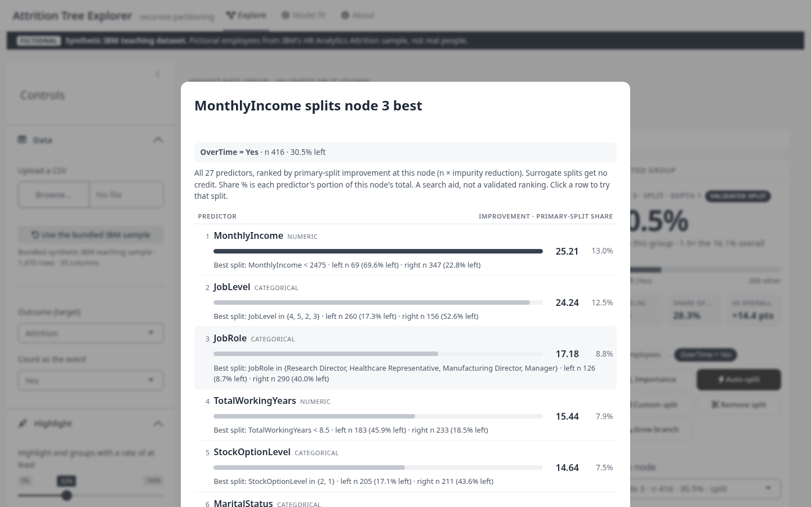
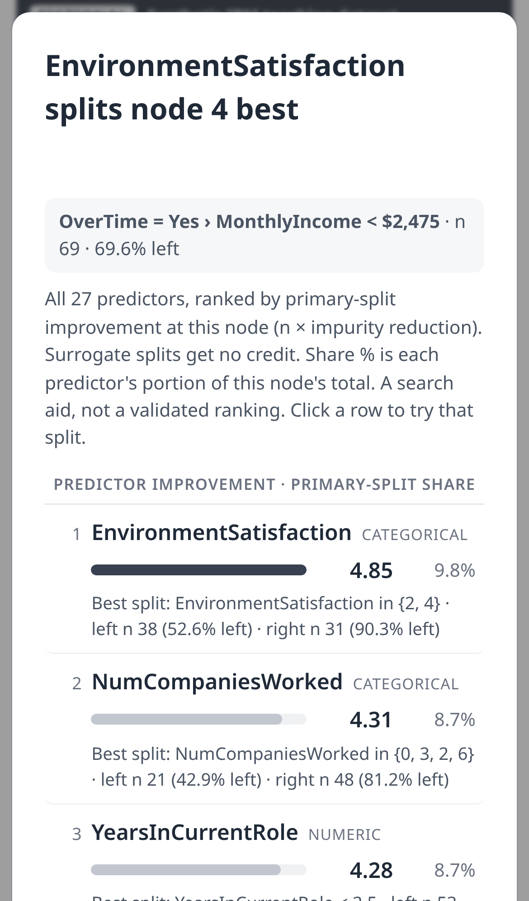
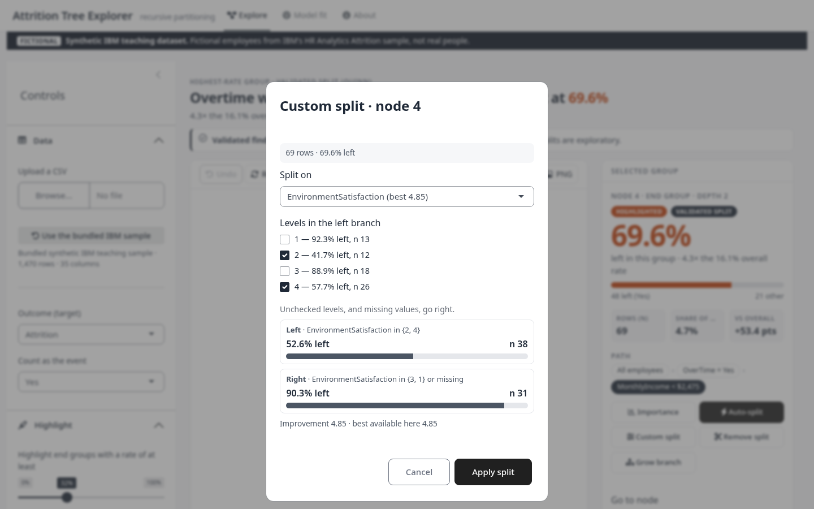
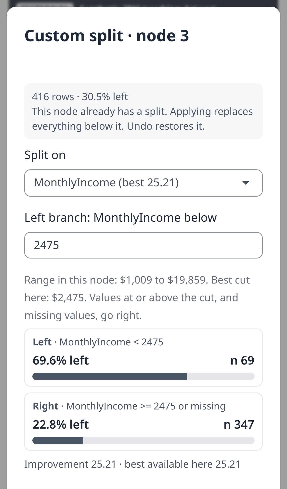

# IBM HR attrition partition

Interactive recursive partitioning for a binary outcome, in the spirit of the Partition platform in SAS JMP. The bundled dataset is IBM's **synthetic teaching sample** (fictional employees, not real people): HR Analytics Employee Attrition, 1,470 rows, target `Attrition`. The app shows that label in a banner, not only here.

Cross-validation supports only two splits as findings: **OverTime**, then **MonthlyIncome under about $2,500 within OverTime**. Deeper splits and any full importance ranking in the app are exploratory. Importance shown in the app is **primary-split only** (surrogate splits get no credit). That is not rpart's default variable importance, which includes surrogates.

Live app: https://jaysha301.shinyapps.io/ibm-hr-attrition-tree/ (v1, until the v2 redesign on branch `app-v2` is approved and deployed).

## What the app does

| Desktop | Phone |
|---|---|
|  |  |
|  |  |
|  |  |
|  |  |

More: `docs/screenshots/desktop_05_full_tree.png`, `desktop_06_model_fit.png`, `mobile_04_longpress_sheet.png`, `mobile_06_controls.png`.

- **Starts on the answer.** The first view is the best root split, then the best split of the higher-risk branch. On the IBM sample that is exactly the two validated splits. A takeaway title computed from the tree states the highest-rate group, e.g. "Overtime workers earning under $2,475 a month left at 69.6%", and labels it validated or exploratory.
- **Readable tree.** Boxes are gray. Only end groups at or above an adjustable rate threshold (default about 2× the overall rate) get the one accent color, along with the branches that lead to them. Line width is proportional to the rows on each branch. Each box shows the rate, n and share of all rows, and names the variable it splits on. There is a legend under the tree.
- **Node actions everywhere.** Right-click a box (desktop), or tap / long-press it (phone, as a bottom action sheet). Actions: Variable importance, Auto-split, Custom split, Grow this branch, Remove split. The same actions are buttons on the Selected group card.
- **Variable importance at any node.** A pop-up ranks all predictors by primary-split improvement at that node, with bars, the best split and both children's n and rate. Surrogate splits get no credit. Click a row to try that split. Download as CSV.
- **Custom split** with a live preview: pick any variable. Numeric variables get a cutpoint prefilled with the best cut. Categorical variables get checkboxes showing each level's rate and n. Both children's n and rate and the improvement update as you edit. It warns, without blocking, when the split breaks the size rules.
- **Selected group card:** a big rate number, a stacked bar, n, share of data, points vs the overall rate, and a clickable breadcrumb path.
- **Undo** for every split, prune, grow and reset. **Zoom / fit / pan / pinch**, **PNG export** of the tree with its title, **CSV export** of leaves, all node rules, and any node's predictor table.
- **First-run tip**, a loading indicator, and the controls collapsed by default on phones behind a labeled Controls button.
- **Model fit tab:** in-sample accuracy (with the majority-class baseline), AUC, sensitivity, specificity, an adjustable-threshold confusion matrix, primary-split importance of the splits used, and a leaf table.
- Upload any CSV with a two-class target. A sticky strip always says whether the data is the fictional IBM sample or your upload.

In-sample fit numbers describe the same rows the tree was grown on. They will look better than a prediction on new employees. `analysis/` is a separate held-out `rpart` study of this same sample (train/test and cross-validation). The app does not use those files.

## Run locally

From this directory:

```bash
Rscript install.R
Rscript tests/smoke.R
Rscript -e 'shiny::runApp(".", host = "127.0.0.1", port = 8073, launch.browser = TRUE)'
```

Then open http://127.0.0.1:8073 . Packages the app attaches: shiny, bslib, magrittr, visNetwork, DT. `install.R` also checks rpart and pROC, which `analysis/attrition_tree.R` uses.

### Regression check (numbers must not change)

```bash
Rscript tests/regression_snapshot.R /tmp/snapshot_new
diff -r analysis/qa/app_v2_regression/v2_after /tmp/snapshot_new && echo IDENTICAL
```

The script drives the real Shiny server. It records the root and OverTime = Yes predictor tables, the two-split view, the full auto tree, leaves, importance and metrics. See `analysis/qa/app_v2_regression.md`.

## Data

See `data/SOURCE.md`. The CSV is IBM's fictional sample. The Kaggle listing (`pavansubhasht/ibm-hr-analytics-attrition-dataset`) is under CC0 1.0 Universal. This repo vendors a public GitHub mirror of that file.

By default the app hides `EmployeeCount`, `EmployeeNumber`, `Over18`, and `StandardHours` (identifier or constant). Check **Include ID and constant columns** to put them back. `DailyRate`, `HourlyRate`, and `MonthlyRate` start unchecked because they are not compensation; select them in **Predictors** if you want them in the tree. Integer columns with 10 or fewer distinct values start as categorical.

## Publish on shinyapps.io

No deploy token is stored in this project. The token and secret are read from environment variables and never printed. From this directory:

```bash
Rscript -e 'rsconnect::setAccountInfo(name = "jaysha301", token = Sys.getenv("SHINYAPPS_TOKEN"), secret = Sys.getenv("SHINYAPPS_SECRET")); rsconnect::deployApp(appDir = ".", appName = "ibm-hr-attrition-tree", account = "jaysha301", appFiles = c("app.R", "R/partition.R", "R/presentation.R", "www/app.css", "www/app.js", "data/WA_Fn-UseC_-HR-Employee-Attrition.csv"), forceUpdate = TRUE, launch.browser = FALSE)'
```

To get a token: sign in at https://www.shinyapps.io as **jaysha301**, then Account → Tokens. Public URL: https://jaysha301.shinyapps.io/ibm-hr-attrition-tree/

Free shinyapps.io apps are public. This dataset is a public fictional sample, so that is appropriate. Do not upload a CSV of real employee records to this app while it is public.

## Project layout

| Path | What it is |
| --- | --- |
| `app.R` | Shiny app (UI and server) |
| `R/presentation.R` | Formatting for the tree, cards, takeaway and exports (no scoring) |
| `www/` | `app.css` (visual system) and `app.js` (node menu, tap/long-press, zoom, PNG export) |
| `docs/screenshots/` | Desktop (1440×900) and phone (390×844) screenshots |
| `R/partition.R` | Split search, custom splits, grow, prune, metrics |
| `data/` | Bundled IBM CSV and source note |
| `tests/smoke.R` | Loads the CSV, checks the root split, grows a tree, grows a default `rpart` tree |
| `tests/regression_snapshot.R` | Numbers snapshot through the Shiny server, for before/after diffs |
| `analysis/` | Held-out `rpart` write-up (separate from the interactive app) |
| `install.R` | Package check |

## Split rules implemented in the app

- Numeric: best cut is the midpoint between adjacent distinct values with the largest impurity reduction. The left branch is `value < cut`.
- Categorical: levels are ordered by the positive-class rate; the best prefix of that order is the candidate split (binary CART). A custom split may put any subset of levels on the left.
- Missing predictor values go to the right branch.
- Improvement is `n` times the impurity reduction at that node. Relative improvement divides by the root impurity total. `cp` is the minimum relative improvement required for an automatic split.
