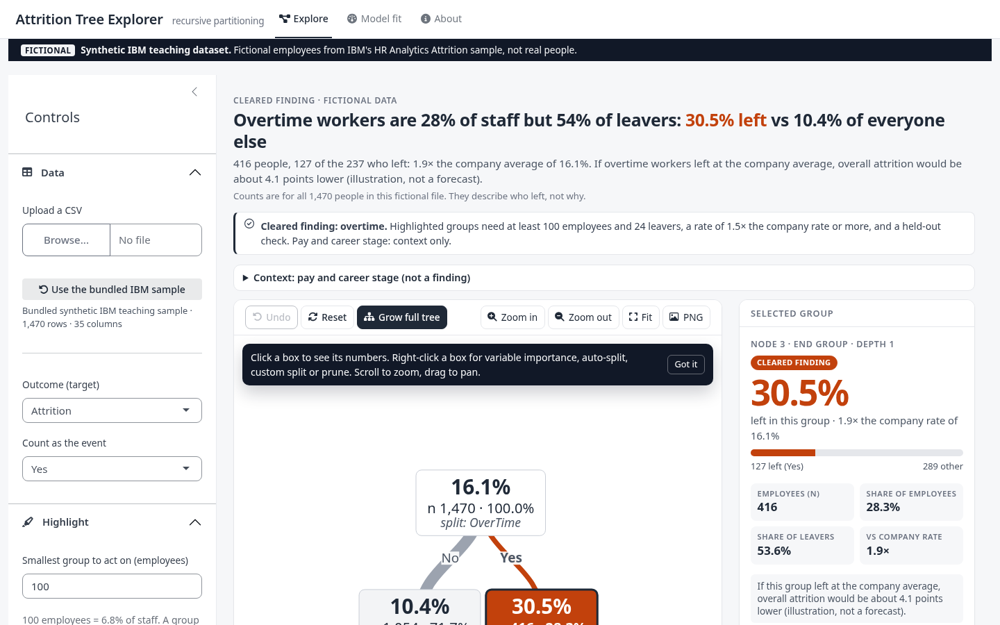
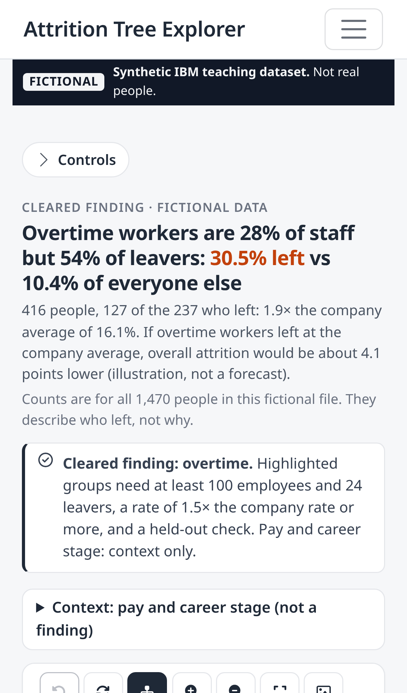
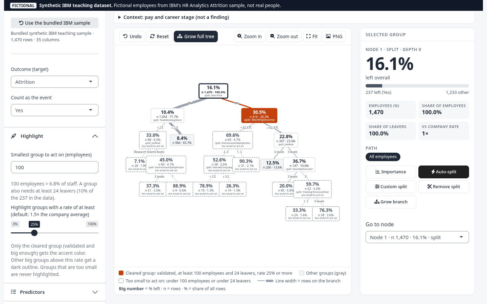
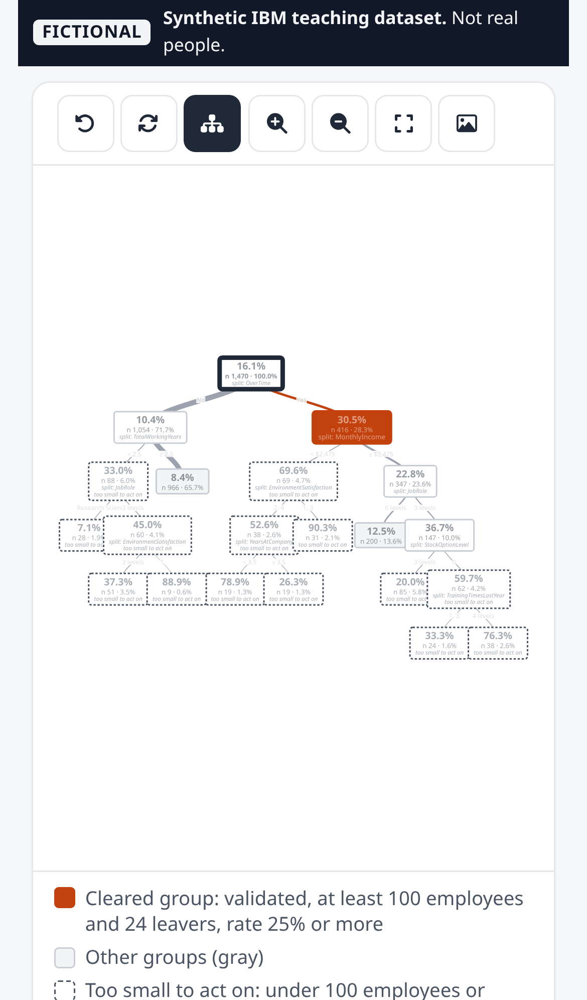
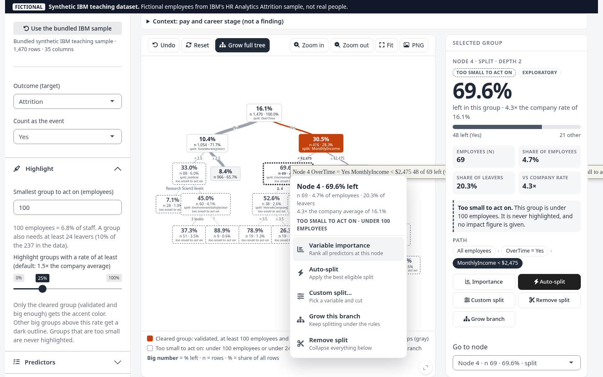
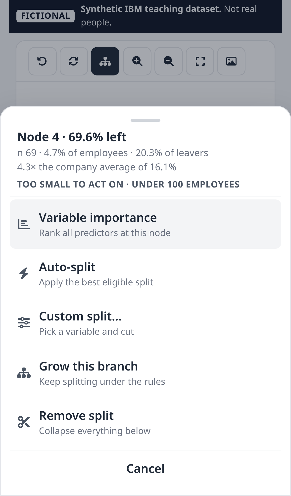
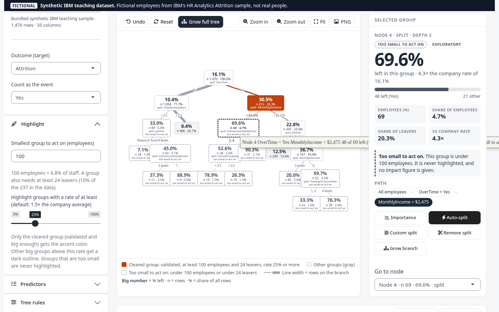
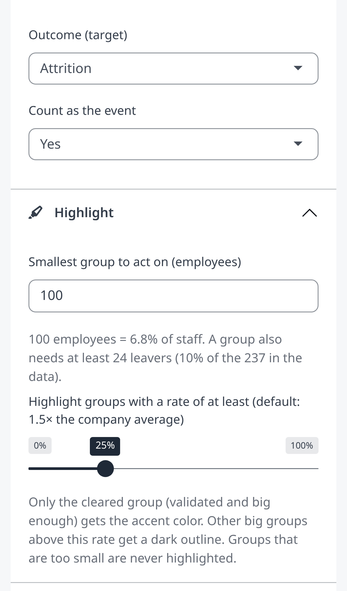

# IBM HR attrition partition

Interactive recursive partitioning for a binary outcome, in the spirit of the Partition platform in SAS JMP. The bundled dataset is IBM's **synthetic teaching sample** (fictional employees, not real people): HR Analytics Employee Attrition, 1,470 rows, target `Attrition`. The app shows that label in a banner, not only here.

**One finding is cleared: overtime.** Overtime workers are 416 of 1,470 people (28%) but 127 of the 237 who left (54%): 30.5% left, against 10.4% of everyone else. A group is highlighted only if it has at least 100 employees and 24 leavers, a rate at least 1.5x the company rate (16.1%), and the same direction on held-out data (rules in `analysis/exec/thresholds.json`). Pay and career stage are shown as context only. Deeper splits, and any importance ranking, are exploratory. Importance in the app is **primary-split only** (surrogate splits get no credit), which is not rpart's default variable importance.

Live app: https://jaysha301.shinyapps.io/ibm-hr-attrition-tree/ (the live site shows v2 until v3 on branch `app-v3` is checked and deployed).

## What the app does (v3)

| Desktop | Phone |
|---|---|
|  |  |
|  |  |
|  |  |
|  |  |

More: `v3_desktop_02_context_menu_cleared.png`, `v3_desktop_05_importance_popup.png`, `v3_desktop_06_node_card_too_small.png`, `v3_desktop_08_model_fit.png`, `v3_desktop_09_about.png`, `v3_mobile_02_action_sheet_cleared.png`, `v3_mobile_05_importance_popup.png`, `v3_mobile_07_longpress_sheet.png`.

- **Starts on the answer.** The first view is the best root split, which on the IBM sample is OverTime. The headline is plain language: "Overtime workers are 28% of staff but 54% of leavers: 30.5% left vs 10.4% of everyone else", with the 416 people, the 127 of 237 leavers, the multiple of the company rate and the impact illustration. No confidence intervals or jargon in the headline.
- **Minimum group size.** A control (default 100 employees) shows what it means, for example "100 employees = 6.8% of staff", and applies a floor of 24 leavers (10% of the 237). Groups under either floor get a dashed outline and a "Too small to act on" label on the node, the hover tip, the tap sheet and right-click menu, the selected-group card and the legend. They are never accented, never headlined, and show no impact figure.
- **One accent.** The accent color is used only for a group that is validated (overtime) and big enough and at or above the highlight rate (default: 1.5x the company rate, 25%). Other big groups above that rate get a dark outline. Everything else is gray.
- **Group facts everywhere.** Each group shows its share of all employees, its share of all leavers, its rate as a multiple of the company rate, and "If this group left at the company average, overall attrition would be about X points lower (illustration, not a forecast)". X = (group leavers - group size x overall rate) / all employees, in points. Do not add it across groups: groups overlap.
- **Node actions everywhere.** Right-click a box (desktop), or tap / long-press it (phone, as a bottom action sheet): Variable importance, Auto-split, Custom split, Grow this branch, Remove split. The same actions are buttons on the Selected group card.
- **Variable importance at any node.** A pop-up ranks all predictors by primary-split improvement at that node, with bars, the best split and both children's n and rate, plus the node's facts and any too-small flag. Surrogate splits get no credit. Download as CSV.
- **Custom split** with a live preview, including a warning when a side would be too small to act on.
- **Context, not a finding:** a collapsed note on pay and career stage (numbers computed from the data at a $3,500 cut).
- **Undo**, zoom / fit / pan / pinch, PNG export of the tree with its title, CSV export of leaves, all node rules (now with share of leavers, multiple of the company rate and the too-small flag), and any node's predictor table.
- **Model fit tab:** "In-sample AUC (this tree on all 1,470 rows)" for whichever tree is on screen, with the held-out comparison: the analysis tree scored 0.670 on the held-out test set (a different measure from the in-sample number).
- Upload any CSV with a two-class target (every split is then exploratory and nothing is accented). A sticky strip always says whether the data is the fictional IBM sample or your upload. Phone and desktop layouts were checked from 320 to 1440 px wide.

**Age, gender and marital status are included only to describe this fictional dataset. Do not use splits on them, or on proxies for them, to select, rate or target real employees.**

In-sample numbers describe the same rows the tree was grown on and will look better than a prediction on new employees. `analysis/` is a separate held-out study of this sample; the app does not read those files at run time.

### Where the typed-in numbers live (update if the analysis is re-run)

Nothing is read from `analysis/` while the app runs, so these are typed into `R/presentation.R`:

| What | Where in the code | Source of truth |
|---|---|---|
| Held-out test figures, CI, stability share for overtime (About tab, technical detail) | `CLEARED_FINDING` | `analysis/exec/candidates.csv` rows `ot_yes` and `ot_no` |
| Size floor 100, lift floor 1.5, leaver share 10% | `RULE_MIN_N`, `RULE_MIN_LIFT`, `RULE_LEAVER_SHARE` | `analysis/exec/thresholds.json` |
| Held-out AUC 0.670 and its sentence on the Model fit tab | `HELD_OUT_AUC`, `HELD_OUT_AUC_TEXT` | `analysis/METHOD.md` (held-out test set) |
| Pay context cut ($3,500) | `PAY_CONTEXT_CUT` | `analysis/exec/thresholds.json`, `context` |
| Which group counts as the cleared finding (OverTime = Yes) | `validation_status()` | `analysis/exec/candidates.csv`, column `pass_all` |

Everything else shown in the headline, cards and menus (counts, shares, rates, the impact figure, the pay context) is computed from the data when the app runs. After re-running the analysis, run `Rscript tests/check_typed_numbers.R`; it compares every typed number with those files and fails if any is out of date.

## Run locally

From this directory:

```bash
Rscript install.R
Rscript tests/smoke.R
Rscript -e 'shiny::runApp(".", host = "127.0.0.1", port = 8073, launch.browser = TRUE)'
```

Then open http://127.0.0.1:8073 . Packages the app attaches: shiny, bslib, magrittr, visNetwork, DT. `install.R` also checks rpart and pROC, which `analysis/attrition_tree.R` uses.

### Regression check (numbers must not change)

```bash
Rscript tests/regression_snapshot.R /tmp/snapshot_new
diff -r analysis/qa/app_v2_regression/v2_after /tmp/snapshot_new && echo IDENTICAL
Rscript tests/check_typed_numbers.R
```

The script drives the real Shiny server. It records the root and OverTime = Yes predictor tables, a two-split tree, the full auto tree, leaves, importance and metrics. The split engine (`R/partition.R`) is unchanged in v3, and the snapshots are byte-identical to v1 and v2. See `analysis/qa/app_v2_regression.md` and `analysis/qa/app_v3_review.md`.

## Data

See `data/SOURCE.md`. The CSV is IBM's fictional sample. The Kaggle listing (`pavansubhasht/ibm-hr-analytics-attrition-dataset`) is under CC0 1.0 Universal. This repo vendors a public GitHub mirror of that file.

By default the app hides `EmployeeCount`, `EmployeeNumber`, `Over18`, and `StandardHours` (identifier or constant). Check **Include ID and constant columns** to put them back. `DailyRate`, `HourlyRate`, and `MonthlyRate` start unchecked because they are not compensation; select them in **Predictors** if you want them in the tree. Integer columns with 10 or fewer distinct values start as categorical.

**Age, gender and marital status are included only to describe this fictional dataset. Do not use splits on them, or on proxies for them, to select, rate or target real employees.**

## Publish on shinyapps.io

No deploy token is stored in this project. The token and secret are read from environment variables and never printed. From this directory:

```bash
Rscript -e 'rsconnect::setAccountInfo(name = "jaysha301", token = Sys.getenv("SHINYAPPS_TOKEN"), secret = Sys.getenv("SHINYAPPS_SECRET")); rsconnect::deployApp(appDir = ".", appName = "ibm-hr-attrition-tree", account = "jaysha301", appFiles = c("app.R", "R/partition.R", "R/presentation.R", "www/app.css", "www/app.js", "data/WA_Fn-UseC_-HR-Employee-Attrition.csv"), forceUpdate = TRUE, launch.browser = FALSE)'
```

To get a token: sign in at https://www.shinyapps.io as **jaysha301**, then Account → Tokens. Public URL: https://jaysha301.shinyapps.io/ibm-hr-attrition-tree/

Free shinyapps.io apps are public. This dataset is a public fictional sample, so that is appropriate. Do not upload a CSV of real employee records to this app while it is public.

## Project layout

| Path | What it is |
| --- | --- |
| `app.R` | Shiny app (UI and server) |
| `R/presentation.R` | Formatting for the tree, cards, takeaway and exports (no scoring) |
| `www/` | `app.css` (visual system) and `app.js` (node menu, tap/long-press, zoom, PNG export) |
| `docs/screenshots/` | Desktop (1440×900) and phone (390×844) screenshots |
| `R/partition.R` | Split search, custom splits, grow, prune, metrics |
| `data/` | Bundled IBM CSV and source note |
| `tests/smoke.R` | Loads the CSV, checks the root split, grows a tree, grows a default `rpart` tree |
| `tests/check_typed_numbers.R` | Compares the typed-in numbers in `R/presentation.R` with `analysis/exec/` and `analysis/METHOD.md` |
| `tests/regression_snapshot.R` | Numbers snapshot through the Shiny server, for before/after diffs |
| `analysis/` | Held-out `rpart` write-up (separate from the interactive app) |
| `install.R` | Package check |

## Split rules implemented in the app

- Numeric: best cut is the midpoint between adjacent distinct values with the largest impurity reduction. The left branch is `value < cut`.
- Categorical: levels are ordered by the positive-class rate; the best prefix of that order is the candidate split (binary CART). A custom split may put any subset of levels on the left.
- Missing predictor values go to the right branch.
- Improvement is `n` times the impurity reduction at that node. Relative improvement divides by the root impurity total. `cp` is the minimum relative improvement required for an automatic split.
